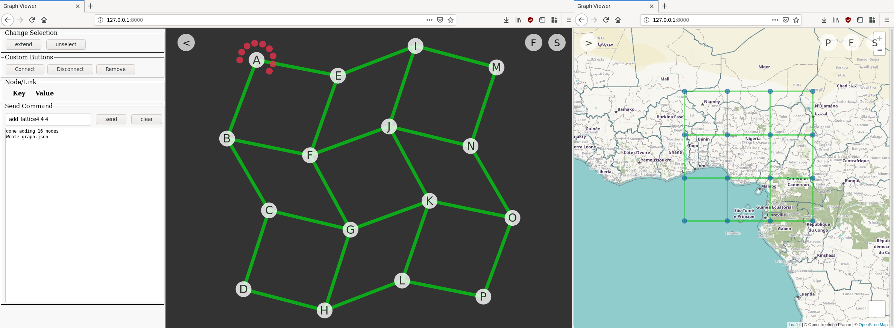

# Graph Viewer

Read a simple json graph file from disk and display a fancy interactive graph. Interactions with the graph (selection, deletion, etc.) can be passed to external programs. The view is updated as soon as the input file is changed.

Written in an unholy combination of C and JavaScript. Build with [d3js](https://d3js.org/), [leafletjs](https://leafletjs.com/) and [libmicrohttpd](https://www.gnu.org/software/libmicrohttpd/).



Topological and geographical view of the same graph. Switch between views with the `S` icon.

## Usage

Usage: `graph-tool [<arguments>] <graph-file>`

Arguments:

* `--graph` *graph-file*  
  Graph topology and data in JSON format. May be first unnamed argument.  
  The graph file is reloaded when its timestamp changes.
* `--call` *path|address*  
  Commands triggered via the web interface are send to an external program,  
  unix socket file or given IP address via TCP/UDP.  
  E.g. `/usr/bin/send_program`, `unix:///var/com.sock`, `tcp://localhost:3000`.
* `--config` *json-file*  
  Configuration file for map tile source and colors etc.
* `--open`  
  Open browser and show graph.
* `--webserver-address` *address*  
  Address for the build-in webserver. Default: 127.0.0.1
* `--webserver-port` *port*  
  Port for the build-in webserver. Default: 8000
* `--webserver-path` *path*  
  Root folder for the build-in webserver. For development. Default: internal
* `--write-out-files` *path*  
  Write included html/js/css files to disk. For development.
* `--version`  
  Print version.
* `--help`  
  Display help.

## Graph JSON format

Minimal graph example:
```
{
  "nodes": [{"id": "a"}, {"id": "b"}],
  "links": [{"source": "a", "target": "b"}]
}
```

More elaborate example:
```
{
  "nodes": [
    {
      "id": "a"
    },
    {
      "id": "b",
      "x": 100,
      "y": 200,
      "label": "Node B",
      "name": "",
      "radius": 12,
      "color": "#fff"
      "clients": 5,
    }
  ],
  "links": [
    {
      "source": "a",
      "target": "b",
      "target_tq": 1,
      "source_tq": 1,
      "label": "Link A/B"
    }
  ]
}
```

Note:

* `id`/`source`/`target`: Node identifier. These are mandatory options.
* `target_tq`/`source_tq`: link quality in the range of `[0..1]`.
* `label`: Display a label on top of a node or link.
* `name`: Display a name under a node.
* `x`/`y`: Geographical position, also used for initial position in topological view.
* `clients`: Display a number of small circles around each node.
* `color`: Color of a node. CSS color format.
* `radius`: Radius of the node circle.

## Build Dependencies

- xxd tool to include html/js/css data into binary (often in package `vim-common`)
- libmicrohttpd development headers

## Run Dependencies

- libmicrohttpd library

## Custom Buttons

Add new buttons using the configuration file [config.json](config.json) and pass it to grap-viewer via the `--config` argument. Other options like colors etc. can be gathered from the internal index.html config object.

## Related Software

* [MeshViewer](https://github.com/ffrgb/meshviewer)
* [graph-tool](https://graph-tool.skewed.de/)
* [NetworkX](https://networkx.github.io/)
* [Gephi](https://gephi.org/)
* [vis.js](http://visjs.org/)
* [igraph](https://igraph.org/redirect.html)

## Authors

The base of the JavaScript/CSS code was taken from the [MeshViewer](https://github.com/ffrgb/meshviewer) project.

## License

All JavaScript/CSS code is AGPL-3 because it is the original license, everything else is MIT.
